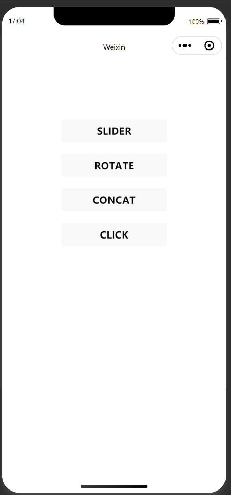
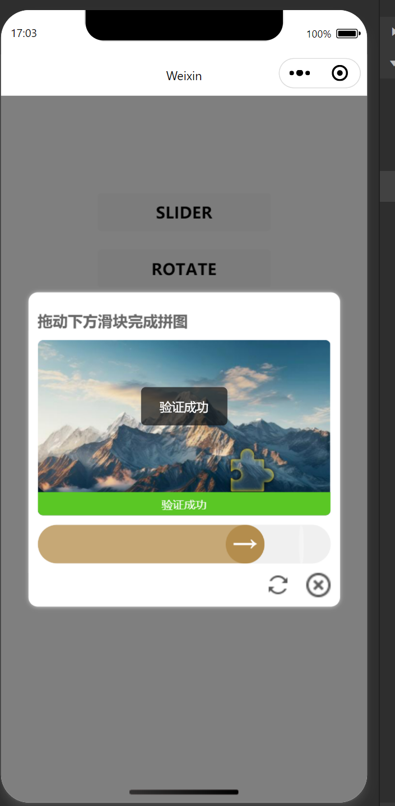
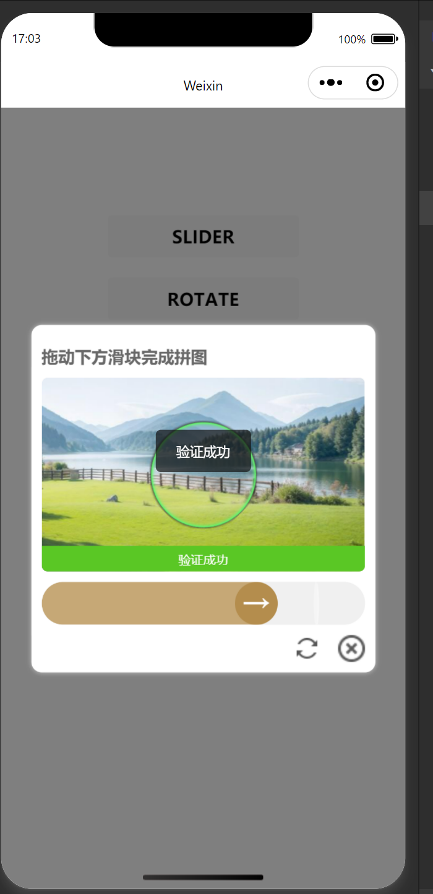
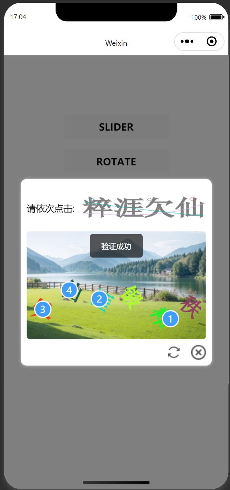

# 验证码组件使用说明

如需原生小程序语法支持，请联系我 1326632@qq.com

## 说明

原 tianai-captcha 仅支持 pc 端，不支持 uniapp 及原生小程序，所以重新封装。由于开发时间有限，我没有从头一点点码代码，而是从 uniapp 的插件市场搜索到一款他人封装好的插件（x-verify-code），此插件就是基于 tianai-captcha 封装，但此插件只支持滑块，经过阅读[tianai-captcha-web-sdk 源码](https://gitee.com/tianai/tianai-captcha-web-sdk "tianai-captcha-web-sdk源码")，经过部分改动，结合我们项目的特点，成功将天爱验证码小程序 uniapp 版本插件搞定，支持滑块、旋转、拼接、点选四种验证方式。

此插件仅供学习参考，仅支持 uniapp 小程序，可以在此基础上进行二次开发，更换为自己框架语法即可。

因为涉及到后端接口，所以需要自行搭建天爱验证码服务端。具体搭建步骤可以参考官方文档：[天爱验证码](http://doc.captcha.tianai.cloud"天爱验证码")

## 组件功能

- 支持四种验证类型：滑块验证（SLIDER）、拼接验证（CONCAT）、旋转验证（ROTATE）、点选验证（WORD_IMAGE_CLICK）
- 记录用户操作轨迹，提高验证安全性
- 提供验证成功/失败反馈
- 支持刷新验证码和关闭验证功能

## 使用截图










## 组件引入

1. 将组件文件放入项目组件目录
2. 在需要使用的页面中引入组件：

```javascript
import verifyCode from "@/uni_modules/tianai-mini-captcha/components/tianai-mini-captcha";
```

3. 注册组件：

```javascript
components: {
  verifyCode;
}
```

## 基本用法

```html
<verify-code
  ref="verifyCode"
  :type="verifyType"
  :conf="verifyConf"
  @success="onVerifySuccess"
></verify-code>
```

## 属性说明

| 属性名 | 类型   | 默认值               | 说明                                                                                       |
| ------ | ------ | -------------------- | ------------------------------------------------------------------------------------------ |
| type   | String | "SLIDER"             | 验证类型，可选值：SLIDER（滑块）、CONCAT（拼接）、ROTATE（旋转）、WORD_IMAGE_CLICK（点选） |
| conf   | Object | {gen:'',validate:''} | 验证接口配置，包含生成验证码和验证接口的 URL                                               |

## 事件说明

| 事件名  | 说明           | 回调参数  |
| ------- | -------------- | --------- |
| success | 验证成功时触发 | 验证码 ID |

## 方法说明

| 方法名    | 说明           | 参数 |
| --------- | -------------- | ---- |
| open()    | 打开验证码弹窗 | 无   |
| close()   | 关闭验证码弹窗 | 无   |
| refresh() | 刷新验证码     | 无   |

## 使用示例

### 1. 基本使用

```javascript
// 页面中
data() {
  return {
    verifyType: 'SLIDER', // 默认滑块验证
      verifyConf:{
        // 生成验证码接口
		    gen:'https://xxxxx/api/captcha/get',
        // 验证接口
		    validate:'https://xxxxx/api/captcha/validate'
	  },
  }
},
methods: {
  // 打开验证码
  showVerify() {
    this.$refs.verifyCode.open()
  },
  // 验证成功回调
  onVerifySuccess(id) {
    console.log('验证成功，验证码ID：', id)
    // 执行后续操作，如登录、提交表单等
  }
}
```

### 2. 切换验证类型

```html
<view>
  <button @click="changeType('SLIDER')">滑块验证</button>
  <button @click="changeType('CONCAT')">拼接验证</button>
  <button @click="changeType('ROTATE')">旋转验证</button>
  <button @click="changeType('WORD_IMAGE_CLICK')">点选验证</button>
  <button @click="showVerify">打开验证</button>
  <verify-code
    ref="verifyCode"
    :type="verifyType"
    :conf="verifyConf"
    @success="onVerifySuccess"
  ></verify-code>
</view>
```

```javascript
methods: {
  changeType(type) {
    this.verifyType = type
  }
}
```

## 注意事项

1. **接口配置**：组件中`requestURL`属性需要配置为实际的后端接口地址，用于获取验证码和验证结果

2. **图片资源**：组件使用了 base64 格式的刷新和关闭图标，如需替换，可修改`refreshIcon`和`closeIcon`属性

3. **样式调整**：组件使用 scss 编写样式，可根据实际需求在 style 标签中修改样式

4. **验证逻辑**：

   - 滑块/旋转/拼接验证：拖动滑块完成验证
   - 点选验证：按提示依次点击图片中的对应元素

5. **兼容性**：组件基于 uni-app 开发，兼容 H5、微信小程序等平台，其他平台可能需要做适当调整

## 常见问题

1. **Q: 验证码图片不显示？**
   A: 检查`conf`是否配置正确，确保后端接口能正常返回图片数据
   B: 检查小程序安全域名

2. **Q: 滑块拖动无反应？**
   A: 检查是否正确引入组件，以及是否有其他元素遮挡了滑块区域

3. **Q: 如何自定义验证码弹窗样式？**
   A: 可修改组件内的 style 样式，或通过深度选择器在父组件中覆盖样式
